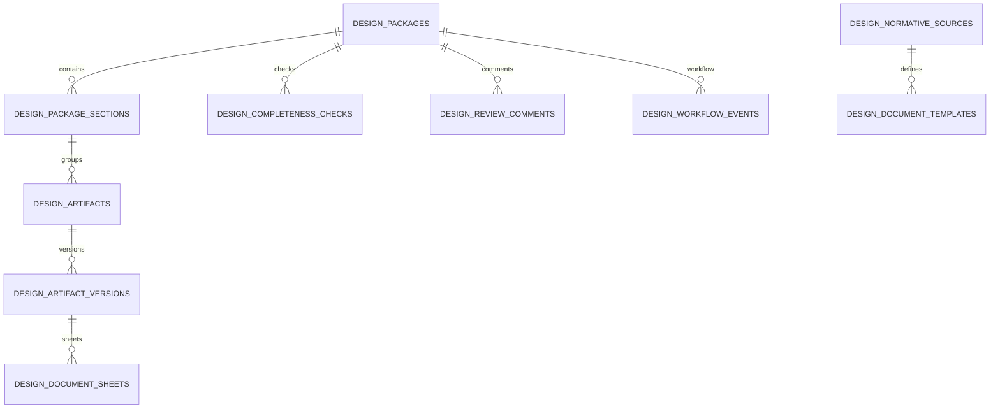
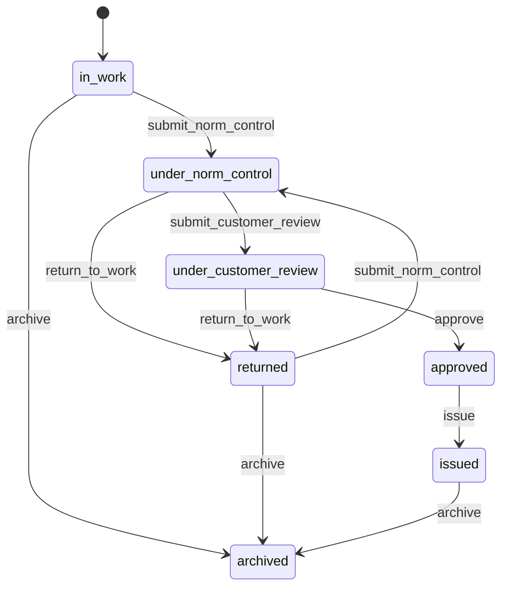

# ПИР РФ: контракт проектной документации

Обновлено: 2026-06-06.

Документ фиксирует реализованный контракт модуля ПИР для проектной документации РФ в админке МОСТ. Модуль остается в существующем контуре `DesignManagement`: BIM/IFC не вынесен отдельно, а дополняется ПД/РД, нормативными профилями, комплектностью, листами, замечаниями, нормоконтролем и выпуском комплекта.

## Нормативная база

- ПП РФ от 16.02.2008 N 87: состав разделов проектной документации и требования к содержанию.
- ГОСТ Р 21.101-2026, действует с 2026-04-01: основные требования к проектной и рабочей документации СПДС.
- ПП РФ от 17.05.2024 N 614: правила информационной модели ОКС и форматов электронных документов.

В коде хранится не полный текст нормативов, а структурированный каталог: код источника, версия, дата начала действия, ссылка на официальный источник, профили комплектности, разделы и обязательные документы.

## Модель данных



Ключевые поля комплекта:

- `project_stage`: `pd`, `rd`, `survey`, `bim`.
- `object_type`: `non_linear_production`, `non_linear_non_production`, `linear`, `organization_custom`.
- `normative_profile_code`: профиль комплектности, например `rf_pd_pp_87_non_linear_2026` или `rf_rd_gost_21_101_2026`.
- `status`: жизненный цикл комплекта от работы до выпуска.
- `available_action_details`: список действий, которые backend разрешает показать пользователю.

Документ хранится как `DesignArtifact` с типом `drawing_set`, `text_document`, `specification`, `statement`, `calculation`, `estimate`, `register` или `model`. Файл версии хранится через `FileService` в S3-пути организации `org-{organization_id}/pir/...`.

## Endpoints

Все пути ниже идут от префикса `/api/v1/admin/design-management`.

| Метод | Путь | Назначение | Право |
|---|---|---|---|
| `GET` | `/packages` | Реестр комплектов ПИР | `design-management.view` |
| `POST` | `/packages` | Создать комплект | `design-management.create` |
| `GET` | `/packages/{packageId}` | Карточка комплекта | `design-management.view` |
| `POST` | `/packages/{packageId}/workflow` | Выполнить workflow-действие | `design-management.view` + право действия |
| `GET` | `/normative-sources` | Нормативные источники | `design-management.normative_catalog.view` |
| `GET` | `/document-templates` | Шаблоны разделов и документов | `design-management.normative_catalog.view` |
| `GET` | `/packages/{packageId}/sections` | Структура разделов комплекта | `design-management.documents.view` |
| `POST` | `/packages/{packageId}/sections/generate` | Сформировать структуру по профилю | `design-management.documents.manage_structure` |
| `POST` | `/packages/{packageId}/sections/{sectionId}/documents` | Загрузить документ раздела | `design-management.documents.upload` |
| `PUT` | `/document-versions/{versionId}/sheets` | Заменить ведомость листов версии | `design-management.documents.edit` |
| `GET` | `/document-versions/{versionId}/source-file` | Скачать исходный файл документа | `design-management.documents.view` |
| `POST` | `/packages/{packageId}/completeness-checks` | Запустить проверку комплектности | `design-management.norm_control.run` |
| `GET` | `/packages/{packageId}/review-comments` | Список замечаний | `design-management.review` |
| `POST` | `/packages/{packageId}/review-comments` | Создать замечание | `design-management.review` |
| `PATCH` | `/review-comments/{commentId}` | Изменить статус замечания | `design-management.review` |
| `GET` | `/packages/{packageId}/issue-register` | Реестр выдачи комплекта | `design-management.export` |

IFC endpoints прежнего контура сохраняются для `model`: загрузка, multipart, подготовка viewer, скачивание исходника и `.frag`.

## Примеры запросов

Создание комплекта:

```json
{
  "project_id": 25,
  "title": "РД Корпус 1",
  "description": "Рабочая документация по корпусу 1",
  "project_stage": "rd",
  "object_type": "non_linear_non_production",
  "normative_profile_code": "rf_rd_gost_21_101_2026",
  "planned_issue_date": "2026-07-15"
}
```

Загрузка документа выполняется `multipart/form-data`:

```text
document_code=AR
title=Архитектурные решения
artifact_type=drawing_set
version_number=1
revision_label=R01
file_format=pdf
document_date=2026-06-06
sheet_registry_required=true
file=@AR.pdf
```

Замена ведомости листов:

```json
{
  "sheets": [
    {
      "sheet_number": "1",
      "sheet_title": "Общие данные",
      "format": "A1",
      "scale": "1:100",
      "revision": "R01",
      "sort_order": 1
    }
  ]
}
```

Workflow-действие:

```json
{
  "action": "return_to_work",
  "comment": "Исправить ведомость листов по разделу АР"
}
```

## Примеры ответов

Фрагмент карточки комплекта:

```json
{
  "id": 15,
  "title": "РД Корпус 1",
  "status": "under_norm_control",
  "project_stage": "rd",
  "object_type": "non_linear_non_production",
  "normative_profile_code": "rf_rd_gost_21_101_2026",
  "models_count": 1,
  "documents_count": 18,
  "latest_completeness_check": {
    "status": "ready",
    "summary": { "ready": 31, "warning": 0, "blocked": 0 }
  },
  "workflow_summary": {
    "available_actions": ["submit_customer_review", "return_to_work"],
    "available_action_details": [
      {
        "action": "submit_customer_review",
        "label": "Передать заказчику",
        "requires_comment": false
      }
    ]
  }
}
```

Результат проверки комплектности:

```json
{
  "id": 44,
  "status": "blocked",
  "profile_code": "rf_rd_gost_21_101_2026",
  "summary": { "ready": 18, "warning": 1, "blocked": 2 },
  "rule_results": [
    {
      "code": "required_current_artifact",
      "status": "blocked",
      "message": "Загрузите обязательный документ раздела АР.",
      "section_id": 7,
      "artifact_id": null,
      "version_id": null
    }
  ]
}
```

## Форматы файлов

Backend валидирует формат по профилю документа и фактическому расширению. Поддержаны:

- `pdf`, `pdfa`: проектные тома, листы, ведомости, печатные комплекты;
- `dwg`, `dxf`: чертежи и рабочие комплекты;
- `docx`, `odt`: текстовые документы;
- `xlsx`, `ods`: спецификации, ведомости и расчетные таблицы;
- `xml`, `zip`: структурированные или пакетные документы;
- `ifc`, `frag`: BIM-модель и подготовленная viewer-версия.

Файлы не сохраняются локально. Для каждой версии фиксируются `file_format`, оригинальное имя, размер, контрольная сумма `sha256`, номер версии, ревизия, дата документа и извлеченные метаданные.

## Проверки комплектности

Проверка выполняется backend rule engine и сохраняется в `design_completeness_checks`.

- `required_section`: обязательный раздел должен существовать в комплекте.
- `required_current_artifact`: обязательный документ раздела должен иметь текущую версию.
- `allowed_file_format`: формат текущей версии должен входить в разрешенный список шаблона документа.
- `revision_sequence`: ревизия обязательного документа должна быть указана и не конфликтовать с версией.
- `sheet_registry`: для чертежных комплектов должна быть заполнена ведомость листов без дублей номеров.
- `open_blocking_comments`: открытые блокирующие замечания запрещают согласование и выпуск.

Итоговый статус:

- `ready`: нет блокеров;
- `warning`: есть предупреждения, но выпуск не заблокирован;
- `blocked`: комплект нельзя передать дальше по workflow.

## Workflow

Активные действия:

- `submit_norm_control`: передать на нормоконтроль;
- `return_to_work`: вернуть в работу, комментарий обязателен;
- `submit_customer_review`: передать заказчику после успешного нормоконтроля;
- `approve`: согласовать комплект;
- `issue`: выпустить комплект;
- `archive`: архивировать.



Админка показывает только `available_action_details`, полученные от backend. Клиент не строит скрытые workflow-переходы самостоятельно.

## Маршруты админки

- `/pir`: реестр комплектов, статусы, готовность, быстрые действия.
- `/pir/packages/:id`: рабочая область комплекта.
- Карточка комплекта содержит зоны: готовность, действия workflow, структура разделов, документы и версии, BIM/IFC, нормоконтроль, замечания, реестр выдачи.
- Диалоги: создание комплекта с выбором стадии/объекта, загрузка документа, ведомость листов, подтверждение workflow-действия.

Пользовательские тексты в интерфейсе не должны показывать технические термины вроде `payload`, `artifact`, `derivative`, `exception`, `legacy`.

## Ролевые права

- `design-management.view`: просмотр реестра и карточек.
- `design-management.create`: создание комплектов.
- `design-management.edit`: изменение общих данных и текущих версий.
- `design-management.review`: замечания и рецензирование.
- `design-management.export`: реестр выдачи.
- `design-management.models.view/upload/prepare_viewer`: BIM/IFC-контур.
- `design-management.documents.view/upload/edit/manage_structure`: документы, версии, листы и структура.
- `design-management.normative_catalog.view`: нормативный каталог.
- `design-management.norm_control.run`: запуск нормоконтроля.

Русские названия прав хранятся в `lang/ru/permissions.php`; роли задаются только JSON-файлами `config/RoleDefinitions`.

## Rollout checklist

- Выполнить миграции на целевом окружении штатным release-процессом.
- Запустить `DesignManagementNormativeCatalogSeeder`, если каталог не был загружен миграционным сценарием окружения.
- Проверить, что S3-диск доступен и сохраняет пути `org-{organization_id}/pir/...`.
- Проверить права проектных ролей и отсутствие технических ключей в UI ролей.
- Создать тестовый комплект `pd` и `rd`, сформировать структуру, загрузить PDF/DWG, заполнить листы, выполнить нормоконтроль.
- Пройти workflow: нормоконтроль, возврат с комментарием, повторная передача, передача заказчику, согласование, выпуск.
- Проверить Project Pulse на блокирующую комплектность и открытые блокирующие замечания.
- Проверить, что IFC viewer продолжает открывать подготовленные модели.
