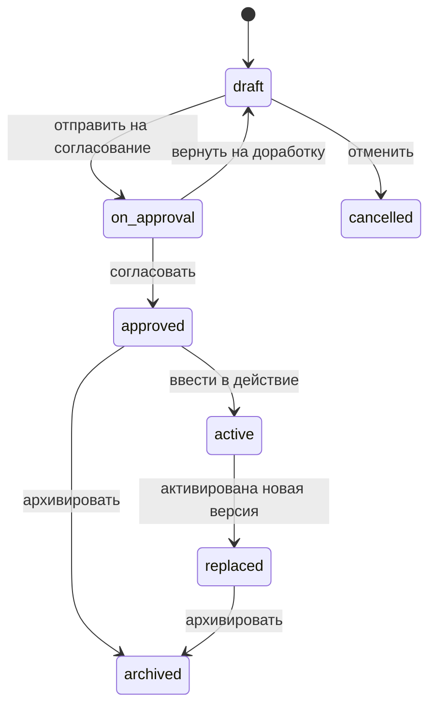
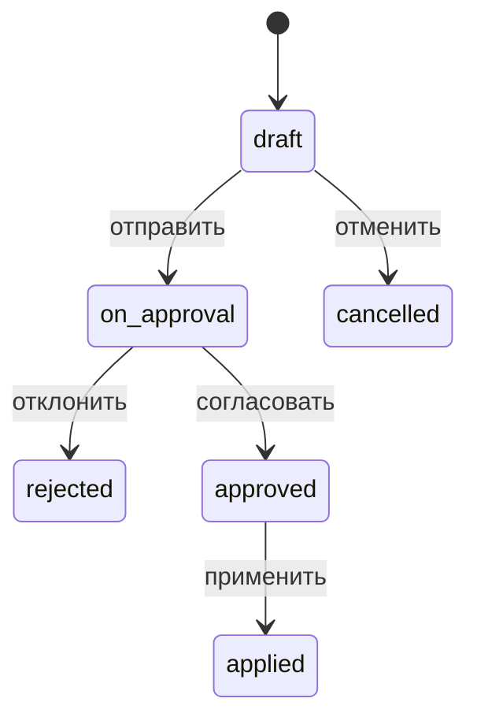
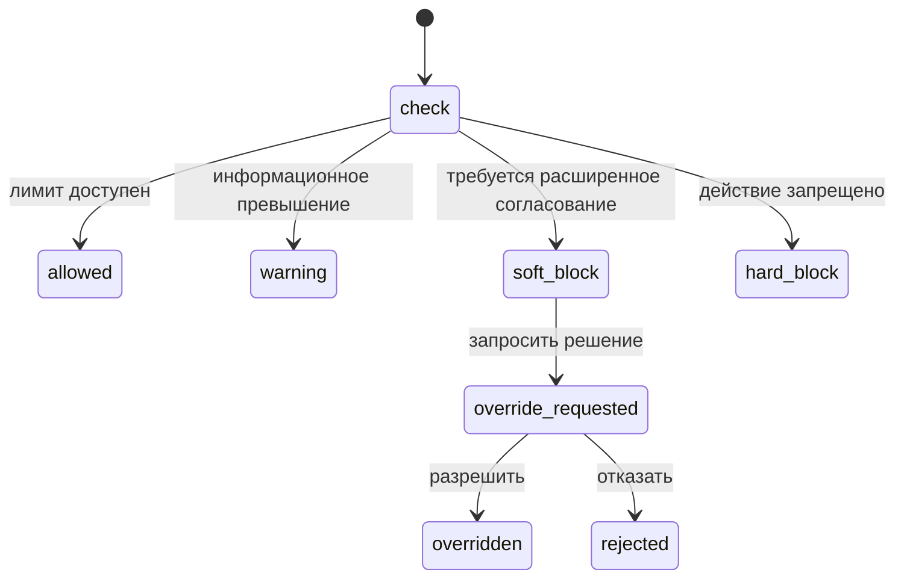

# Workflow, роли и permissions для БДР/БДДС

Задача: PHERP-80.

Дата проектирования: 2026-06-08.

Статус: спецификация будущих workflow и прав. Код, роли и переводы в рамках этой задачи не менялись.

## Назначение

Документ описывает пользовательские сценарии, статусы, роли и permissions для управленческого бюджетирования: БДР, БДДС, ЦФО, budget period, scenario, version, plan, fact, forecast, limit и closed period.

ProHelper остается source of truth для управленческого бюджета и лимитов. 1С остается source of truth для бухгалтерского и налогового учета. Workflow не должен создавать prohibited accounting duplication.

## Статусы версий

Правила:

- `draft` редактируется автором и пользователями с правом `budgeting.budgets.edit`;
- `on_approval` блокирует изменение строк;
- `approved` фиксирует строки и разрешает активацию;
- `active` используется для plan/fact/forecast и limit checks;
- `replaced`, `archived`, `cancelled` доступны только для просмотра и аудита;
- новая active version заменяет предыдущую в той же комбинации организация, budget period, scenario и тип бюджета.

## Статусы корректировок

Корректировка обязательна, если:

- бюджетная версия уже `approved` или `active`;
- period имеет статус `soft_closed`, `closed` или `reopened_for_adjustment`;
- изменение влияет на лимиты, экспорт в 1С или план-факт прошлого периода.

## Статусы периода

| Статус | Значение | Действия |
| --- | --- | --- |
| `open` | обычная работа с черновиками | создание версий, импорт, согласование |
| `soft_closed` | период предварительно закрыт | сверка fact, ограниченные корректировки |
| `closed` | closed period | прямые изменения запрещены |
| `reopened_for_adjustment` | временное окно корректировки | только согласованная корректировка |
| `archived` | исторический период | просмотр, экспорт, аудит |

Закрытие периода ProHelper является управленческим и не равно бухгалтерскому закрытию в 1С.

## Workflow начальной настройки

1. Финансовый администратор создает budget period.
2. Создает или выбирает scenario: базовый, оптимистичный, стрессовый или пользовательский.
3. Настраивает каталог статей и проверяет mapping с `cost_categories` и 1С.
4. Создает дерево ЦФО.
5. Импортирует XLSX/CSV или создает draft version вручную.
6. Проверяет preview: пустые статьи, нераспознанные ЦФО, дубли, суммы, валюты.
7. Сохраняет строки бюджета.
8. Отправляет версию на согласование.
9. Финансовый директор или другой согласующий утверждает версию.
10. Ответственный вводит версию в действие.

## Workflow plan/fact/forecast

1. `plan` берется из active version.
2. `fact` БДР собирается из управленческих источников начисления: акты, выполненные работы, складские списания, подотчет, закупочные приемки по утвержденному правилу.
3. `fact` БДДС собирается из завершенных платежных транзакций и сверенных банковских выписок.
4. `forecast` пересчитывается из незакрытых обязательств, payment schedule, purchase orders, договорных графиков, остатка сметы и ожидаемых корректировок.
5. Пользователь видит отклонения по статье, ЦФО, проекту, договору, контрагенту и месяцу.
6. Drill-down открывает исходный документ только при наличии прав на него.

## Workflow лимитов

Проверка limit должна запускаться при:

- согласовании заявки на закупку;
- подтверждении заказа поставщику;
- отправке платежной заявки;
- согласовании платежного документа;
- постановке платежа в график;
- регистрации фактического платежа;
- применении корректировки бюджета.

Проверка должна учитывать:

- утвержденный plan;
- уже отраженный fact;
- forecast;
- утвержденные, но еще не оплаченные платежные документы;
- открытые заказы поставщикам;
- договорные обязательства;
- ручные overrides.

Каждый override сохраняет пользователя, время, причину, сумму, исходный документ и результат проверки.

## Workflow 1С

1. Экспорт в 1С доступен только для approved или active version и примененных корректировок.
2. Экспорт формирует операцию обмена с идемпотентным ключом по организации, `one_c_base_id`, `integration_profile_id`, типу источника, id источника и hash версии.
3. 1С может принять, отклонить или потребовать mapping.
4. Ошибка mapping не откатывает бюджетный статус, а переводит операцию обмена в статус для разбора.
5. Данные из 1С не должны перезаписывать управленческие лимиты, причины корректировок и версии бюджета.

## Admin UI сценарии

Новый раздел рекомендуется разместить в финансовом контуре admin UI как `Бюджетирование`.

### Реестр бюджетов

Функции:

- фильтры по организации, периоду, scenario, типу бюджета, статусу, проекту и ЦФО;
- summary по active/draft/on approval версиям;
- быстрые действия: открыть, создать версию, импортировать, отправить на согласование;
- индикаторы превышения лимитов и закрытого периода;
- empty state с действием создания первого бюджета;
- loading state с сохранением высоты таблицы;
- error state с бизнес-понятным текстом и повтором запроса.

### Карточка бюджета

Вкладки:

- `Обзор`: summary, статус, текущая version, ответственные;
- `БДР`: дерево статей доходов и расходов;
- `БДДС`: денежные поступления и выплаты;
- `План-факт`: plan, fact, forecast, отклонения;
- `Лимиты`: active limits, превышения, overrides;
- `Согласование`: маршрут, комментарии, история решений;
- `Источники факта`: drill-down по актам, платежам, складу и закупкам;
- `1С`: mapping, export-preview, статусы обмена.

### Табличное редактирование

Поведение:

- редактирование разрешено только для draft version;
- строки группируются по статье и ЦФО;
- месячные значения имеют фиксированные колонки;
- итоговые строки считаются автоматически;
- ячейки с ошибками импорта показывают человекочитаемую причину;
- сохранение выполняется пакетно;
- при переходе из draft в on approval таблица становится read-only.

### Импорт XLSX/CSV

Шаги:

1. загрузка файла;
2. определение колонок;
3. mapping статей, ЦФО, проектов и месяцев;
4. preview с ошибками и предупреждениями;
5. commit в draft version.

Ошибки должны быть прикладными: "Статья не найдена", "ЦФО неактивен", "Месяц вне периода", "Сумма указана в неподдерживаемой валюте".

### Согласование

Сценарии:

- очередь "Мои согласования";
- действие "Согласовать";
- действие "Вернуть на доработку";
- обязательный комментарий при отклонении;
- отображение истории изменений и комментариев;
- запрет согласования собственной версии, если политика организации этого требует.

### План-факт

Сценарии:

- выбор периода, scenario, version, ЦФО, проекта;
- переключатель БДР/БДДС;
- группировка по статье, ЦФО, проекту, договору, месяцу;
- раскрытие строки до исходных документов;
- экспорт отчета при наличии права;
- отдельное отображение forecast и превышений.

## Роли

| Роль | Ответственность | Основные права |
| --- | --- | --- |
| Владелец организации | полный контроль бюджетного контура организации | все `budgeting.*` в рамках организации |
| Финансовый администратор | периоды, сценарии, статьи, ЦФО, версии | управление справочниками и версиями |
| Финансовый контролер | проверка plan/fact/forecast, закрытие периода | отчеты, сверка, closed period, корректировки |
| Финансовый директор | финальное согласование и overrides | approve, activate, override |
| Руководитель проекта | план и факт своего проекта | view, edit draft по своим ЦФО, plan_fact.view |
| Закупщик | видит лимиты при закупках | limit check, view по связанным статьям |
| Складской ответственный | видит складские факты по своим ЦФО | fact drill-down по складу |
| Бухгалтер или интеграционный специалист | mapping и обмен с 1С | sync view/export, articles.map_1c |
| Аудитор | просмотр истории без изменений | audit.view, read-only reports |

Роли не должны хардкодиться в PHP. Для реализации будущих прав нужно обновлять JSON RoleDefinitions и `lang/ru/permissions.php`, чтобы UI не получал технические ключи вместо русских подписей.

## Предлагаемые permissions

| Permission | Русское название |
| --- | --- |
| `budgeting.budgets.view` | Просмотр бюджетов |
| `budgeting.budgets.create` | Создание бюджетов |
| `budgeting.budgets.edit` | Редактирование черновиков бюджета |
| `budgeting.budgets.submit` | Отправка бюджета на согласование |
| `budgeting.budgets.approve` | Согласование бюджета |
| `budgeting.budgets.activate` | Ввод бюджета в действие |
| `budgeting.budgets.edit_approved` | Корректировка утвержденного бюджета |
| `budgeting.budgets.archive` | Архивирование бюджета |
| `budgeting.periods.view` | Просмотр бюджетных периодов |
| `budgeting.periods.manage` | Управление бюджетными периодами |
| `budgeting.periods.close` | Закрытие бюджетного периода |
| `budgeting.periods.reopen` | Открытие периода для корректировки |
| `budgeting.scenarios.view` | Просмотр сценариев бюджета |
| `budgeting.scenarios.manage` | Управление сценариями бюджета |
| `budgeting.articles.view` | Просмотр статей бюджета |
| `budgeting.articles.manage` | Управление статьями бюджета |
| `budgeting.articles.import` | Импорт статей бюджета |
| `budgeting.articles.map_1c` | Сопоставление статей с 1С |
| `budgeting.cfo.view` | Просмотр ЦФО |
| `budgeting.cfo.manage` | Управление ЦФО |
| `budgeting.limits.view` | Просмотр лимитов бюджета |
| `budgeting.limits.manage` | Управление лимитами бюджета |
| `budgeting.limits.override` | Разрешение превышения лимита |
| `budgeting.plan_fact.view` | Просмотр план-факта |
| `budgeting.plan_fact.export` | Экспорт план-факта |
| `budgeting.import.preview` | Проверка импортируемого бюджета |
| `budgeting.import.commit` | Применение импортируемого бюджета |
| `budgeting.audit.view` | Просмотр аудита бюджетирования |
| `budgeting.sync.view` | Просмотр обмена бюджетов с 1С |
| `budgeting.sync.export` | Экспорт бюджетных данных в 1С |

## Доступ к данным

Доступ пользователя должен проверяться не только по permission, но и по области:

- organization;
- project;
- responsibility center;
- linked warehouse;
- linked contract;
- source document.

Пользователь не должен видеть сумму по ЦФО или проекту, если у него нет права на этот контур. Для агрегатов нужно применять ту же область доступа, иначе summary может раскрыть закрытые финансовые данные.

## Риски и открытые вопросы

- Нужно решить, какие роли могут закрывать period и открывать closed period для корректировки.
- Нужно утвердить запрет или разрешение на согласование собственной версии бюджета.
- Нужно определить, кто может делать limit override и в каких суммовых пределах.
- Нужно выбрать порядок согласования: по ЦФО, по проекту, по организации или смешанный маршрут.
- Нужно решить, создается ли новая version при каждой корректировке или хранится delta с расчетом итоговой версии.
- Нужно согласовать, какие статусы 1С видит UI и какие действия доступны при ошибке exchange.
- Нужно определить правила отображения данных, если у пользователя есть право на бюджет, но нет права на исходный платеж, акт или закупку.
- Нужно проверить, не конфликтуют новые permissions с текущими `payments.*`, `procurement.*`, `warehouse.*`, `budget-estimates.*` и `one_c_exchange.*`.
