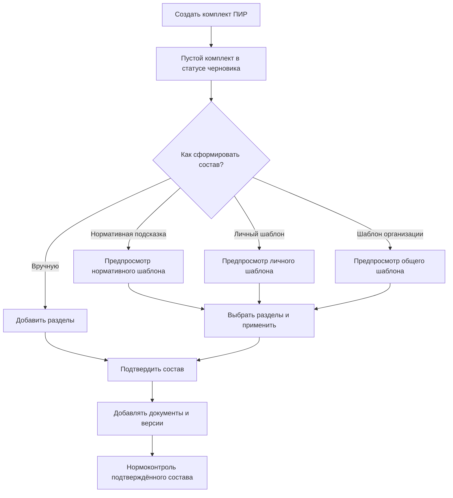
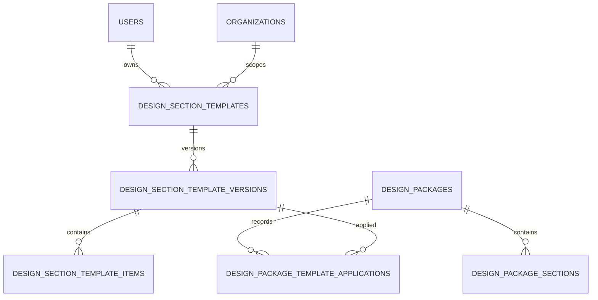

# МОСТ: управляемый состав комплектов ПИР и пользовательские шаблоны

Дата: 2026-07-13

Статус: продуктово-техническая концепция, код не изменён

Область: модуль ПИР, backend МОСТ и административный интерфейс

## 1. Назначение документа

Документ фиксирует оценку текущего сценария работы с комплектами ПИР и согласованное целевое поведение:

- новый комплект создаётся без автоматически добавленных разделов;
- состав комплекта определяет пользователь;
- нормативные профили остаются подсказкой, но не изменяют комплект без подтверждения;
- пользователь может сохранять собственные шаблоны состава для будущих работ;
- шаблоны бывают личными и общими для организации;
- публикация и управление общими шаблонами контролируются отдельными правами;
- нормоконтроль проверяет подтверждённый состав конкретного комплекта.

Документ не является разрешением на реализацию. Перед разработкой требуется отдельный план и подтверждение пользователя.

## 2. Оценка текущего решения

### 2.1. Что уже хорошо устроено

В модуле уже существует подходящая основа:

- комплект ПИР является самостоятельной сущностью с проектом, стадией, типом объекта и сроком выпуска;
- разделы, документы, версии, листы, замечания и проверки комплектности разделены по ответственности;
- нормативный каталог вынесен отдельно от фактического комплекта;
- есть серверная операция формирования разделов по нормативному профилю;
- есть ручное добавление пользовательского раздела;
- структура комплекта участвует в нормоконтроле и процессе согласования;
- права на просмотр, загрузку документов, управление структурой и нормоконтроль разделены.

Это позволяет изменить сценарий без отказа от существующей архитектуры модуля.

### 2.2. Главная продуктовая проблема

Сейчас при создании комплекта backend сразу формирует структуру разделов по выбранному или автоматически определённому нормативному профилю. Пользователь получает уже заполненный комплект, хотя ещё не подтвердил его состав.

Такое поведение создаёт несколько проблем:

1. Система выдаёт нормативную подсказку за фактическое решение проектировщика.
2. В комплект могут попасть разделы, не относящиеся к конкретной работе.
3. Пользователю приходится разбираться с лишними позициями вместо формирования нужного состава.
4. Автоматически созданные обязательные разделы начинают влиять на готовность и нормоконтроль.
5. Ошибка или чрезмерно широкий нормативный шаблон превращается в ошибку каждого нового комплекта.
6. Пользователь не понимает, является ли раздел нормативно обязательным, рекомендуемым системой или внутренним требованием организации.

Проблема находится не только в интерфейсе: автогенерация выполняется внутри серверной операции создания комплекта. Поэтому скрыть разделы на клиенте недостаточно.

### 2.3. Недостатки текущего UI/UX

- После создания комплекта пользователь не проходит явный этап подтверждения состава.
- Автоматически созданные разделы визуально выглядят как окончательная структура.
- Действие формирования структуры существует отдельно, но фактически структура уже формируется при создании.
- Диалог «Добавить раздел» одновременно требует сведения о разделе и первом документе. Это смешивает два разных действия.
- Пустой комплект трактуется как ситуация «разделы не сгенерированы», хотя в целевой модели пустой состав является нормальным черновым состоянием.
- Не хватает объяснения происхождения элемента: нормативная подсказка, личный шаблон, шаблон организации или ручное добавление.
- Не предусмотрен повторно используемый состав организации или конкретного специалиста.

## 3. Принятое продуктовое решение

Рекомендуется гибридная модель: пустой комплект по умолчанию и добровольные шаблоны.

### 3.1. Основные принципы

1. Создание комплекта и формирование его состава — разные операции.
2. Новый комплект всегда создаётся пустым.
3. Ни один раздел не добавляется без явного действия пользователя.
4. Пользователь может собрать состав вручную или применить шаблон.
5. Перед применением любого шаблона показывается предварительный состав.
6. Пользователь выбирает, какие разделы применить.
7. Применение шаблона копирует структуру в комплект; дальнейшее изменение комплекта не изменяет исходный шаблон.
8. Изменение шаблона не должно незаметно менять уже созданные комплекты.
9. Нормоконтроль работает с подтверждённым составом комплекта.
10. Происхождение каждого раздела сохраняется для аудита, но не ограничивает обычное редактирование комплекта.

### 3.2. Рассмотренные варианты

#### Вариант A. Только ручное создание

Преимущества:

- максимальная свобода пользователя;
- отсутствует риск навязанного состава.

Недостатки:

- повторный ручной ввод;
- разнобой кодов и названий;
- выше вероятность пропусков;
- сложнее тиражировать стандарты организации.

#### Вариант B. Автоматическое создание по нормативному профилю

Преимущества:

- быстрый старт;
- единообразие структуры.

Недостатки:

- текущая проблема сохраняется;
- пользователь не контролирует момент применения;
- ошибка каталога автоматически попадает во все комплекты.

#### Вариант C. Пустой комплект и добровольные шаблоны

Преимущества:

- контроль остаётся у пользователя;
- нормативные знания сохраняются как подсказка;
- можно повторно использовать личные и организационные практики;
- источник состава понятен и проверяем.

Недостатки:

- требуется отдельный интерфейс выбора состава и управления шаблонами;
- нужно продумать права, версии шаблонов и аудит.

Выбран вариант C.

## 4. Целевой пользовательский сценарий

### 4.1. Создание комплекта

Форма создания содержит только сведения о самом комплекте:

- проект;
- название;
- стадия;
- тип объекта;
- дисциплина, если используется;
- плановая дата выпуска;
- нормативный профиль как необязательная подсказка для следующего шага.

После сохранения пользователь переходит в карточку пустого комплекта.

### 4.2. Пустое состояние

В блоке структуры показывается сообщение:

> В комплекте пока нет разделов. Добавьте их вручную или используйте шаблон состава.

Действия:

- основное: «Добавить раздел»;
- дополнительное: «Выбрать шаблон»;
- при наличии подходящего профиля: «Посмотреть нормативную подсказку».

Пустой состав не является технической ошибкой. Это допустимое состояние черновика. Однако отправка на нормоконтроль блокируется, пока состав не подтверждён.

### 4.3. Ручное создание раздела

Первый диалог создаёт только раздел:

- код раздела;
- название;
- обязательность для этого комплекта;
- порядок;
- необязательное пояснение;
- необязательная нормативная ссылка.

Документы создаются внутри сохранённого раздела отдельным действием. Пользователь не обязан одновременно придумывать раздел и первый документ.

Формулировка «Обязательный» относится к составу конкретного комплекта. Она не должна создавать впечатление, что пользователь самостоятельно присвоил требование государственному нормативу.

### 4.4. Применение шаблона

Шаблон никогда не применяется мгновенно из списка. Сначала открывается предварительный просмотр:

- название и описание шаблона;
- владелец и область видимости;
- стадия и тип объекта, для которых он предназначен;
- дата обновления и версия;
- список разделов и документов;
- отметки обязательности;
- источник каждой позиции;
- предупреждение о возможных совпадениях с текущим составом.

Пользователь может:

- выбрать все разделы;
- снять выбор с ненужных разделов;
- выбрать отдельные документы внутри разделов;
- увидеть будущие изменения до сохранения;
- отменить применение без изменения комплекта.

### 4.5. Подтверждение состава

После ручного формирования или применения шаблона пользователь подтверждает состав. До подтверждения комплект остаётся в состоянии «Состав не подтверждён».

После подтверждения:

- нормоконтроль использует выбранные обязательные разделы и документы;
- разрешается передача на следующий этап процесса;
- изменения состава фиксируются в аудите;
- существенное изменение состава сбрасывает ранее пройденную проверку комплектности.

## 5. Каталог шаблонов

### 5.1. Типы шаблонов

#### Нормативные шаблоны

Поддерживаются командой МОСТ и используются только как справочная подсказка. Пользователь не редактирует их напрямую.

Для каждой позиции необходимо различать:

- нормативно обязательную;
- условно применимую;
- рекомендуемую;
- информационную или корпоративную.

Если позиция не следует непосредственно из нормативного источника, её нельзя показывать как нормативно обязательную.

#### Личные шаблоны

Видны только создателю. Предназначены для повторяющихся личных сценариев работы.

Пользователь может:

- создать шаблон с нуля;
- сохранить текущий состав комплекта как шаблон;
- копировать существующий доступный шаблон в личный;
- редактировать, архивировать и дублировать свои шаблоны;
- предложить личный шаблон для публикации в организации при наличии соответствующего права.

#### Шаблоны организации

Доступны пользователям одной организации. Предназначены для корпоративных стандартов и повторяющихся типов работ.

Создание или публикация общего шаблона требует отдельного права. Обычный пользователь может применять доступный шаблон, не получая права на его изменение.

### 5.2. Жизненный цикл шаблона

Предлагаемые состояния:

- `draft` — черновик, виден владельцу и редакторам;
- `published` — доступен для применения в своей области видимости;
- `archived` — нельзя применять в новых комплектах, но история и связи сохраняются.

Для первой версии продукта не требуется сложное согласование шаблонов. Достаточно отдельного права публикации организационного шаблона и аудита действий.

### 5.3. Версионирование

Шаблон имеет версию. При изменении опубликованного шаблона создаётся новая версия либо фиксируется неизменяемый снимок его состава.

Комплект хранит:

- идентификатор применённого шаблона;
- версию шаблона;
- дату применения;
- пользователя, применившего шаблон;
- фактически выбранный состав.

Комплект не зависит от последующих изменений шаблона. Обновить состав по новой версии можно только отдельным действием с просмотром различий.

### 5.4. Создание шаблона из комплекта

В карточке комплекта доступно действие «Сохранить состав как шаблон».

Пользователь указывает:

- название;
- описание;
- область видимости: личный или организация;
- стадию;
- тип объекта;
- дисциплину при необходимости;
- включаемые разделы и документы.

Файлы, версии документов, замечания, сроки и история согласования в шаблон не копируются. Сохраняется только повторно используемая структура и правила комплектности.

## 6. Права доступа

Предлагаемое разделение прав:

| Возможность | Право |
|---|---|
| Просмотр доступных шаблонов | `design-management.templates.view` |
| Создание личного шаблона | `design-management.templates.create_personal` |
| Редактирование своих шаблонов | `design-management.templates.edit_personal` |
| Применение шаблона к комплекту | `design-management.templates.apply` |
| Публикация шаблона организации | `design-management.templates.publish_organization` |
| Редактирование общих шаблонов | `design-management.templates.manage_organization` |
| Архивирование общих шаблонов | `design-management.templates.archive_organization` |

Дополнительно сохраняется существующее право управления структурой комплекта. Применение шаблона к комплекту требует одновременно права на применение шаблона и права на изменение структуры этого комплекта.

Все права должны иметь русские человекочитаемые названия в интерфейсе управления ролями.

## 7. Целевая модель данных

Ниже приведена концептуальная модель, а не готовая миграция.

### 7.1. Шаблон

Основные атрибуты:

- владелец;
- организация;
- область видимости: `personal`, `organization`, `system`;
- название и описание;
- стадия, тип объекта и дисциплина;
- статус;
- текущая версия;
- источник: нормативный, пользовательский или корпоративный;
- даты создания, публикации и архивирования.

### 7.2. Элемент шаблона

Элемент описывает раздел и, при необходимости, вложенный документ:

- код и название раздела;
- порядок;
- обязательность для состава;
- код и название документа;
- тип документа;
- допустимые форматы;
- необходимость реестра листов;
- нормативная ссылка;
- категория применимости;
- пояснение пользователю.

### 7.3. Применение шаблона

Отдельная запись аудита содержит:

- комплект;
- шаблон и его версию;
- пользователя;
- выбранные элементы;
- пропущенные элементы;
- разрешённые конфликты;
- дату применения.

## 8. Предварительный API-контракт

Точные пути и поля утверждаются в плане реализации. Предлагаемая поверхность:

| Метод | Путь | Назначение |
|---|---|---|
| `GET` | `/api/v1/admin/design-management/section-templates` | Доступные системные, личные и организационные шаблоны |
| `POST` | `/api/v1/admin/design-management/section-templates` | Создать личный или организационный шаблон |
| `GET` | `/api/v1/admin/design-management/section-templates/{templateId}` | Карточка и текущая версия шаблона |
| `PATCH` | `/api/v1/admin/design-management/section-templates/{templateId}` | Изменить доступный для редактирования шаблон |
| `POST` | `/api/v1/admin/design-management/section-templates/{templateId}/publish` | Опубликовать шаблон организации |
| `POST` | `/api/v1/admin/design-management/section-templates/{templateId}/archive` | Архивировать шаблон |
| `POST` | `/api/v1/admin/design-management/packages/{packageId}/template-preview` | Получить предварительный результат применения |
| `POST` | `/api/v1/admin/design-management/packages/{packageId}/apply-template` | Применить подтверждённый выбор |
| `POST` | `/api/v1/admin/design-management/packages/{packageId}/sections` | Создать пустой раздел вручную |
| `PATCH` | `/api/v1/admin/design-management/packages/{packageId}/sections/{sectionId}` | Изменить раздел |
| `DELETE` | `/api/v1/admin/design-management/packages/{packageId}/sections/{sectionId}` | Удалить раздел с безопасной проверкой зависимостей |
| `POST` | `/api/v1/admin/design-management/packages/{packageId}/confirm-structure` | Подтвердить состав комплекта |
| `POST` | `/api/v1/admin/design-management/packages/{packageId}/save-as-template` | Сохранить состав как новый шаблон |

### 8.1. Требования к применению шаблона

- Предпросмотр не изменяет данные.
- Применение выполняется транзакционно.
- Повтор одного запроса не создаёт дубли.
- Конфликты кодов возвращаются как бизнес-понятный список.
- Пользователь явно выбирает стратегию для совпадений: пропустить, дополнить существующий раздел или создать копию с новым кодом.
- Backend повторно проверяет права и принадлежность всех сущностей организации.
- Ответ возвращает фактически созданные и пропущенные элементы, предупреждения и новое состояние подтверждения состава.

## 9. Нормоконтроль и готовность

### 9.1. Новые состояния структуры

Для комплекта необходимо различать:

- `empty` — разделов нет;
- `draft` — разделы добавлены, но состав не подтверждён;
- `confirmed` — состав подтверждён;
- `changed` — подтверждённый состав был существенно изменён и требует повторного подтверждения.

Эти состояния не обязаны становиться отдельным полем статуса всего комплекта. Они могут быть отдельным состоянием структуры.

### 9.2. Правила проверки

Нормоконтроль не должен предполагать, что системный нормативный шаблон автоматически является составом комплекта.

Проверка выполняется по следующей логике:

1. Если состав пуст или не подтверждён, возвращается один понятный блокирующий результат: «Сформируйте и подтвердите состав комплекта».
2. Для подтверждённого состава проверяются обязательные разделы и документы, выбранные для этого комплекта.
3. Для применённого нормативного шаблона дополнительно могут выводиться предупреждения о пропущенных нормативных рекомендациях.
4. Условно применимые позиции не становятся блокерами без подтверждённого основания.
5. После существенного изменения состава предыдущий результат проверки считается устаревшим.

Таким образом, нормативная подсказка помогает пользователю, но не подменяет его решение и не создаёт ложные обязательства.

## 10. UI/UX каталога шаблонов

### 10.1. Точки входа

- карточка комплекта: «Выбрать шаблон»;
- карточка комплекта: «Сохранить состав как шаблон»;
- отдельный раздел ПИР: «Шаблоны состава»;
- пустое состояние структуры комплекта;
- меню действий существующего шаблона.

### 10.2. Реестр шаблонов

Фильтры:

- все доступные;
- нормативные;
- мои;
- организации;
- стадия;
- тип объекта;
- дисциплина;
- активные и архивные.

В строке или карточке показываются:

- название;
- тип и область видимости;
- владелец;
- версия;
- количество разделов и документов;
- совместимость с текущим комплектом;
- дата обновления;
- действия в соответствии с правами.

### 10.3. Безопасные взаимодействия

- Публикация организационного шаблона требует подтверждения.
- Архивирование не удаляет исторические версии.
- Удаление раздела с документами требует предупреждения и явного подтверждения.
- При применении шаблона пользователь всегда видит различия.
- Технические коды не используются как основные пользовательские названия.
- Для загрузки, ошибки, пустого результата и отсутствия прав предусмотрены отдельные состояния.

## 11. Совместимость и переход

### 11.1. Новые комплекты

После выпуска изменения все новые комплекты создаются без разделов.

### 11.2. Существующие комплекты

- Автоматически созданные ранее разделы не удаляются.
- Состав существующего комплекта считается текущим рабочим составом.
- При необходимости пользователь может сохранить его как личный или организационный шаблон.
- Массовая автоматическая очистка существующих комплектов не выполняется.
- Отдельное действие «Пересобрать состав» допускается только с предварительным сравнением и подтверждением.

### 11.3. Существующий нормативный генератор

Он не удаляется, а меняет назначение:

- перестаёт вызываться при создании комплекта;
- используется для построения предварительного просмотра нормативной подсказки;
- применяет только выбранные пользователем позиции;
- не перезаписывает пользовательские разделы и документы без явного решения по конфликту.

## 12. Аудит и наблюдаемость

В аудите фиксируются:

- создание и изменение разделов;
- подтверждение и повторное подтверждение состава;
- применение шаблона и его версии;
- создание личного шаблона;
- публикация, изменение и архивирование организационного шаблона;
- разрешение конфликтов при применении;
- изменение обязательности раздела или документа.

Для продуктового анализа полезны метрики:

- доля комплектов, собранных вручную;
- доля применений нормативных, личных и организационных шаблонов;
- среднее время до подтверждения состава;
- частота удаления разделов после применения шаблона;
- наиболее используемые шаблоны;
- доля комплектов, возвращённых из-за неполного состава.

## 13. Ошибки и крайние случаи

Необходимо предусмотреть:

- одинаковый код раздела в комплекте и шаблоне;
- шаблон без разделов;
- архивированный шаблон;
- потерю права между предпросмотром и применением;
- шаблон другой организации;
- одновременное редактирование состава двумя пользователями;
- изменение версии шаблона после открытия предпросмотра;
- попытку архивировать используемый шаблон;
- раздел с документами при удалении;
- смену стадии или типа объекта после подтверждения состава;
- применение нескольких шаблонов к одному комплекту;
- повторный запрос после сетевого сбоя;
- отсутствие подходящей нормативной подсказки.

Смена стадии, типа объекта или нормативного профиля должна помечать состав как требующий повторной проверки, но не удалять пользовательские данные автоматически.

## 14. Проверки и критерии приёмки

### 14.1. Backend

- Создание комплекта не создаёт разделы.
- Пустой комплект возвращается корректным API-ответом.
- Пользователь может создать раздел без одновременного создания документа.
- Предпросмотр шаблона не изменяет данные.
- Применение создаёт только подтверждённые элементы.
- Повторное применение с тем же ключом не создаёт дубли.
- Личный шаблон недоступен другим пользователям.
- Организационный шаблон изолирован от других организаций.
- Публикация и управление общим шаблоном защищены правами.
- Изменение шаблона не меняет ранее созданный комплект.
- Нормоконтроль проверяет подтверждённый состав.
- Изменение подтверждённого состава помечает проверку как устаревшую.
- Все изменения структуры и шаблонов попадают в аудит.

### 14.2. UI

- После создания открывается понятный пустой комплект.
- Пользователь видит ручное добавление и выбор шаблона.
- Нормативная подсказка визуально не выдаётся за обязательный состав.
- Перед применением шаблона виден полный результат и конфликты.
- Личные и организационные шаблоны визуально различаются.
- Недоступные действия скрыты или корректно заблокированы по правам.
- Диалог раздела не требует создавать документ.
- После применения или изменения структура обновляется без перезагрузки страницы.
- Состояния загрузки, ошибки, отсутствия данных и отсутствия прав понятны пользователю.
- Сценарий работает на типовом ноутбуке и на узком экране.

### 14.3. Регрессия

- Загрузка документов и версий продолжает работать.
- Реестр листов не меняет контракт.
- IFC-сценарий не зависит от источника состава разделов.
- Замечания и процесс согласования сохраняют связи с разделами.
- Существующие комплекты остаются доступными и не теряют структуру.
- Реестр выдачи отображает фактический состав комплекта.

## 15. Риски и ограничения

### Риск: пользователь пропустит важный раздел

Снижение риска: нормативная подсказка, отметки применимости, предупреждения нормоконтроля и возможность использовать утверждённый шаблон организации.

### Риск: организация накопит много похожих шаблонов

Снижение риска: права публикации, поиск, архивирование, владелец, версия и возможность копирования вместо неконтролируемого общего редактирования.

### Риск: шаблон будет восприниматься как юридическая гарантия

Снижение риска: явно показывать источник, версию, дату актуальности и формулировку «подсказка». Не называть пользовательские и корпоративные позиции нормативно обязательными.

### Риск: изменение структуры нарушит ранее пройденный процесс

Снижение риска: сбрасывать актуальность проверки комплектности и требовать повторного подтверждения состава.

## 16. Границы первой реализации

В первую версию рекомендуется включить:

- пустой комплект;
- ручное раздельное создание разделов и документов;
- предварительный просмотр нормативной подсказки;
- личные шаблоны;
- организационные шаблоны с отдельным правом публикации;
- сохранение состава комплекта как шаблона;
- применение выбранных элементов;
- версию или неизменяемый снимок шаблона;
- аудит;
- обновлённую проверку комплектности.

Не включать в первую версию без отдельного запроса:

- публичный обмен шаблонами между организациями;
- платный каталог шаблонов;
- сложный маршрут согласования публикации;
- автоматическое обновление существующих комплектов;
- автоматическое объединение конфликтующих разделов без подтверждения;
- генерацию структуры с помощью ИИ.

## 17. Итоговое решение

МОСТ не должен автоматически создавать разделы при создании комплекта ПИР. Новый комплект является пустым черновиком, а пользователь осознанно формирует его состав вручную или с помощью предварительно просмотренного шаблона.

Нормативные профили сохраняются как профессиональная подсказка. Дополнительно вводятся личные и организационные шаблоны, чтобы пользователи могли закреплять собственную практику и повторно использовать её в будущих работах. Публикация шаблона на организацию требует отдельного права.

Такой подход сохраняет полезность нормативного каталога, убирает навязанный и потенциально неверный состав, ускоряет повторяющиеся работы и делает ответственность за структуру комплекта прозрачной.
