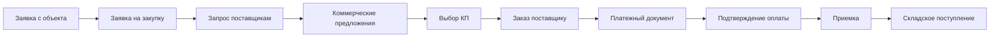

# Закупочная цепочка

## Назначение

Закупочная цепочка показывает сквозное состояние закупки от исходной заявки с объекта до складского поступления. Это вычисляемый workflow, а не статус одной таблицы: backend собирает связанные документы, вычисляет текущий этап, next action и блокеры, а UI только визуализирует и ведет пользователя к разрешенному действию.

## Путь процесса

## Backend contract

Основной контракт возвращается `ProcurementChainResource`:

- `root`: документ, из которого открыли цепочку.
- `current_stage`: текущий сквозной этап.
- `next_action`: рекомендуемое действие с `href`, `method`, правом и признаком доступности.
- `blockers`: причины, которые блокируют следующий шаг.
- `warnings`: предупреждения без жесткой блокировки.
- `linked_documents`: документы цепочки с переходами.
- `stages`: вся карта этапов.
- `permissions`: результат проверки прав для действий.
- `compact`: короткая версия для списков.

Endpoints:

- `GET /api/v1/admin/procurement/chains/site-requests/{id}`
- `GET /api/v1/admin/procurement/chains/purchase-requests/{id}`
- `GET /api/v1/admin/procurement/chains/purchase-orders/{id}`
- `GET /api/v1/admin/procurement/chains/payment-documents/{id}`
- `GET /api/v1/admin/procurement/chains/purchase-receipts/{id}`
- `POST /api/v1/admin/procurement/purchase-orders/{id}/payment-document`

`POST /purchase-orders/{id}/payment-document` идемпотентен: если документ уже есть, возвращает существующий; если нет, создает платежный документ с нашей организацией как плательщиком и поставщиком из КП/заказа как получателем.

## Guards

UI показывает понятный путь, но не заменяет серверные ограничения.

- Приемка материалов остается заблокированной, если нет подтвержденной оплаты.
- Создание/открытие оплаты проверяет `payments.invoice.create`.
- Просмотр карты цепочки проверяет `procurement.chain.view`.
- Действия в `next_action` показываются только после проверки прав, но backend повторно валидирует каждое действие.

## UI surfaces

- В заявке с объекта и заявке на закупку показывается блок `Закупочная цепочка`.
- В заказе поставщику, платежном документе и полной карте есть переход назад к цепочке.
- В реестрах заявок с объекта, заявок на закупку, заказов и платежных документов показывается компактный статус цепочки.
- Полная карта доступна по `/procurement/chains/:context/:id`.

## Проверки

Минимальный набор перед релизом:

- `php artisan test --filter=ProcurementChainServiceTest`
- `php artisan test --filter=ProcurementChainControllerTest`
- `npx vitest run src/components/procurement/chain/ProcurementChainCompactStatus.test.tsx src/services/procurementApiService.test.ts`
- `npx tsc --noEmit`
